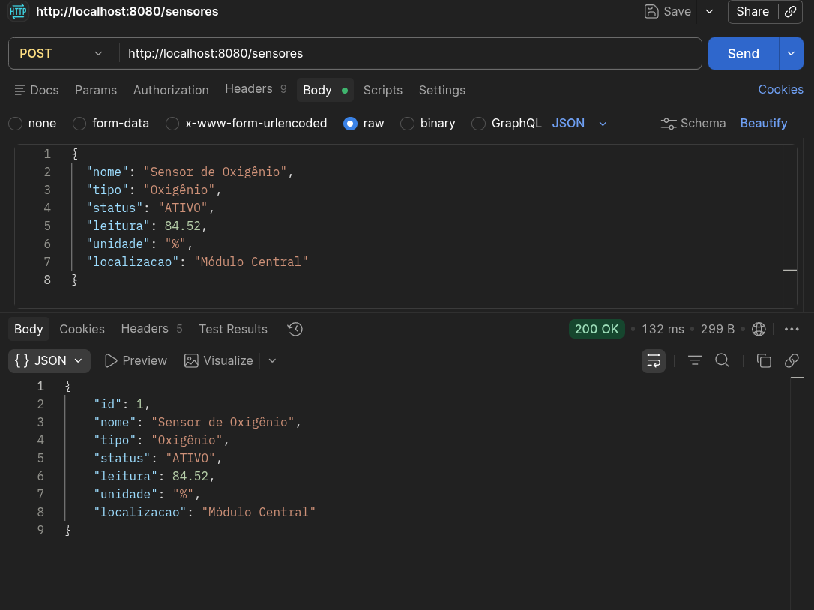
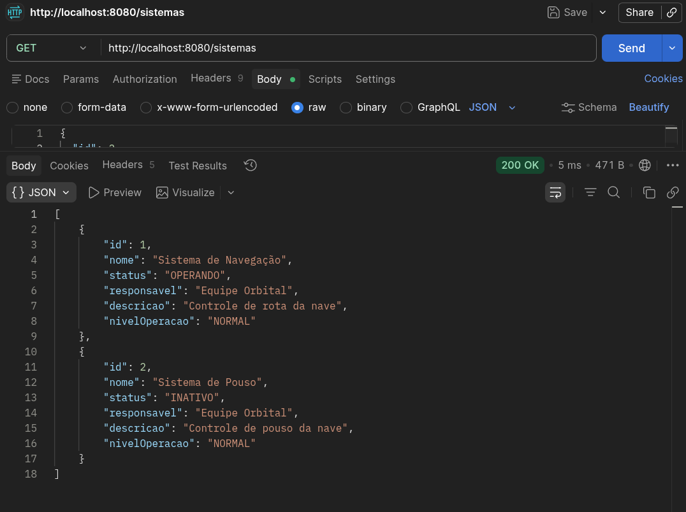
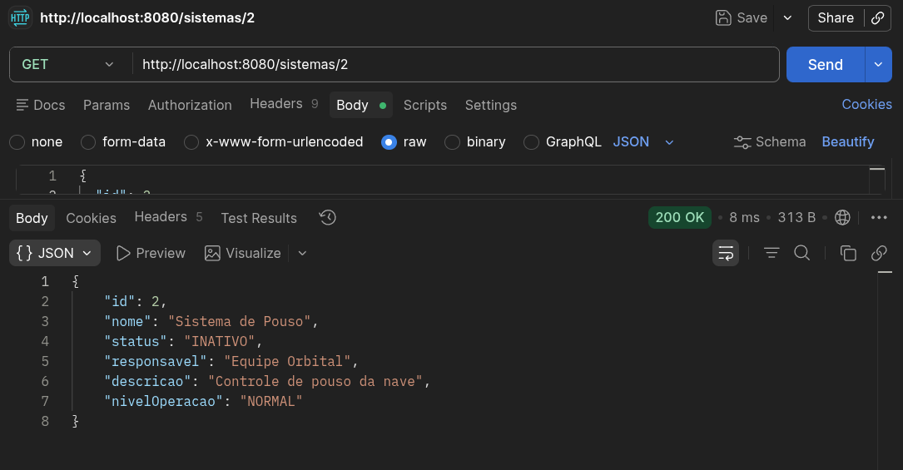
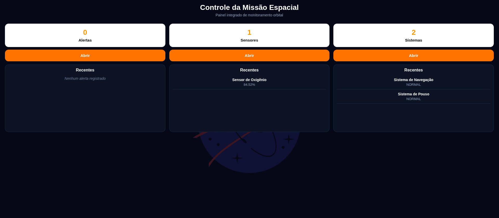
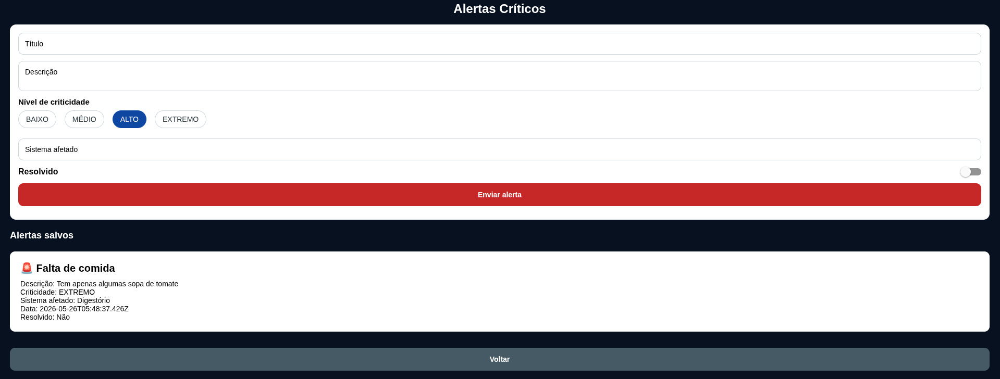
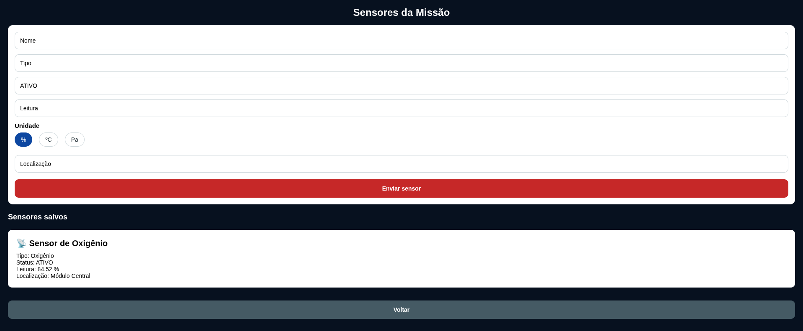
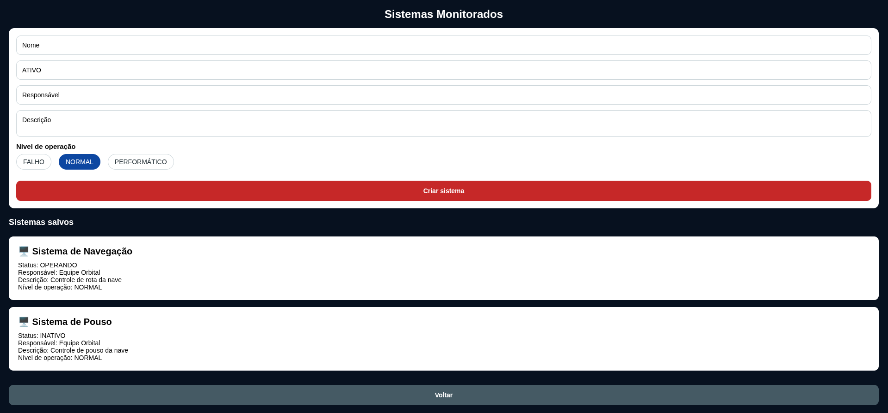

# Global Solution - Space Connect 🚀

## 🖥️ Descrição
A aplicação possui uma interface mobile/web em React Native com TypeScript integrada a uma API desenvolvida em Java com Spring Boot. O sistema permite o gerenciamento de informações operacionais de missões espaciais, incluindo sensores, sistemas monitorados e alertas críticos.

O frontend se comunica com o backend através de requisições HTTP, utilizando principalmente métodos GET e POST para envio e consulta de dados em tempo real. As informações são armazenadas em um banco de dados H2 com persistência em arquivo, garantindo que os registros sejam mantidos mesmo após a reinicialização da aplicação.

A interface foi projetada com foco em ser simples, oferecendo uma visualização organizada e funcional dos chamados ativos relacionados a missão, com o próprio dashboard inicial possuindo um resumo das principais informações do sistema.

Abaixo segue um exemplo de requisição POST feita no Postman para implementar dados:



E abixo segue duas imagens mostrando requisições GET, com a primeira sendo geral enquanto a segunda é por ID específico:





Tela inicial da interface:



Tela de alertas:



Tela de sensores:



Tela de sistemas:



## 🗂️ Estrutura do Projeto
```
Advanced-Programming-Mobile-Dev/
├── Backend/
│   ├── src/
│   │   └── main/
│   │       ├── java/
│   │       │   └── GS1/
│   │       │       ├── controller/
│   │       │       │   ├── AlertaController.java
│   │       │       │   ├── SensorController.java
│   │       │       │   └── SistemaController.java
│   │       │       ├── model/
│   │       │       │   ├── Alerta.java
│   │       │       │   ├── Sensor.java
│   │       │       │   └── Sistema.java
│   │       │       ├── repository/
│   │       │       │   ├── AlertaRepository.java
│   │       │       │   ├── SensorRepository.java
│   │       │       │   └── SistemaRepository.java
│   │       │       ├── service/
│   │       │       │   ├── AlertaService.java
│   │       │       │   ├── SensorService.java
│   │       │       │   └── SistemaService.java
│   │       │       ├── config/
│   │       │       │   └── CorsConfig.java
│   │       │       └── Application.java
│   │       └── resources/
│   │           └── application.properties
│   ├── data/
│   │   └── banco.mv.db
│   ├── pom.xml
│   └── mvnw
│
├── Frontend/
│   ├── assets/
│   │   └── background.png
│   ├── src/
│   │   ├── components/
│   │   │   ├── InfoCard.tsx
│   │   │   └── OptionChips.tsx
│   │   ├── screens/
│   │   │   ├── HomeScreen.tsx
│   │   │   ├── AlertasScreen.tsx
│   │   │   ├── SensoresScreen.tsx
│   │   │   └── SistemasScreen.tsx
│   │   ├── services/
│   │   │   └── api.ts
│   │   ├── types/
│   │   │   ├── Alerta.ts
│   │   │   ├── Sensor.ts
│   │   │   └── Sistema.ts
│   │   └── navigation/
│   │       └── AppNavigator.tsx
│   ├── App.tsx
│   ├── package.json
│   ├── tsconfig.json
│   └── node_modules/
└── README.md
```
