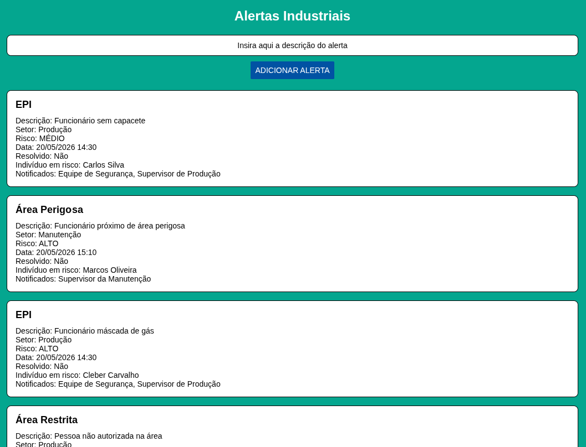
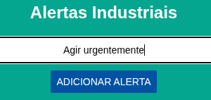
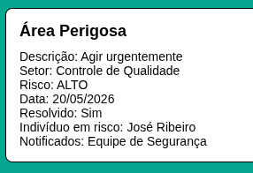
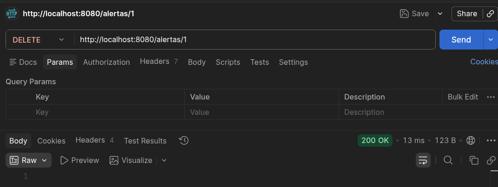

# Challenge Sprint 2 📱

## 🖥️ Descrição do Frontend
A aplicação desenvolvida nessa sprint representa um sistema mobile de monitoramento de alertas industriais em um cenário de segurança baseado em visão computacional. O aplicativo foi desenvolvido utilizando React Native com Expo e TypeScript, simulando o funcionamento de um sistema de detecção de riscos em ambiente industrial.

O app permite visualizar alertas industriais, exibir informações relacionadas ao tipo de risco, setor afetado, nível de severidade, funcionários envolvidos e grupos notificados, além de permitir a criação de novos alertas diretamente pela interface utilizando estado local.

Por se tratar de uma aplicação frontend sem integração com backend, os dados utilizados no sistema são mockados através de arrays locais em TypeScript. Alguns dados dos alertas são gerados aleatoriamente, como nível de severidade, setor, tipo de risco e indivíduo sob risco, simulando diferentes situações industriais.

A proposta foi desenvolvida com React Native, Expo, TypeScript e componentes nativos do React Native, seguindo o padrão das aulas.

## 🗂️ Estrutura do Projeto
```
src/
├── components
│   └── AlertaCard.tsx
├── data
│   └── Alertas.ts
├── screens
│   └── AlertaScreen.tsx
└── types
    └── AlertaIndustrial.ts
```
## ⚙️ Como utilizar 

Para executar o programa, é necessário possuir o Node.js e o Expo instalado em uma IDE compatível (no meu caso utilizei o Visual Studio Code para isso). Para fazer a instalação inicial, basta abrir um terminal novo e digitar:
```
npm install

#e após finalizar#

npx expo start
```
Após iniciar o projeto, o Expo abrirá o painel de execução no navegador, permitindo executar o aplicativo no celular através do Expo Go ou em um emulador Android/iOS.

O aplicativo funciona totalmente com estado local e dados mockados, não utilizando integração com backend ou APIs externas nesta sprint.

A aplicação 2 pode ser acessada via navegador pelo endereço:
http://localhost:8081/


Primeiramente



Após



Depois



Por fim



Os dados